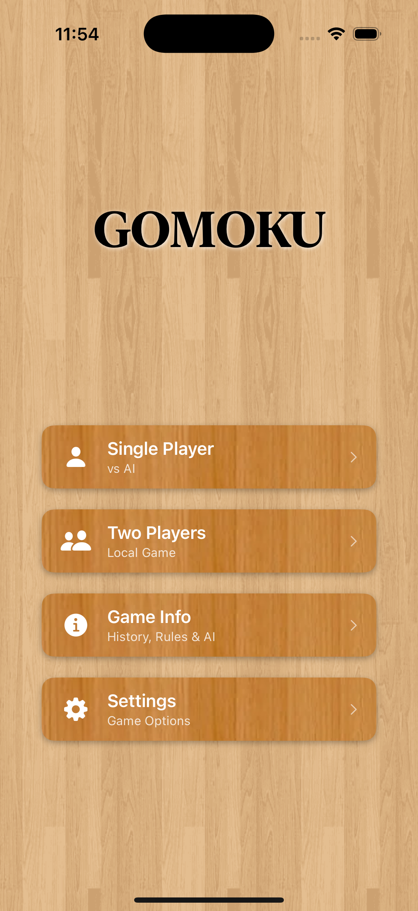
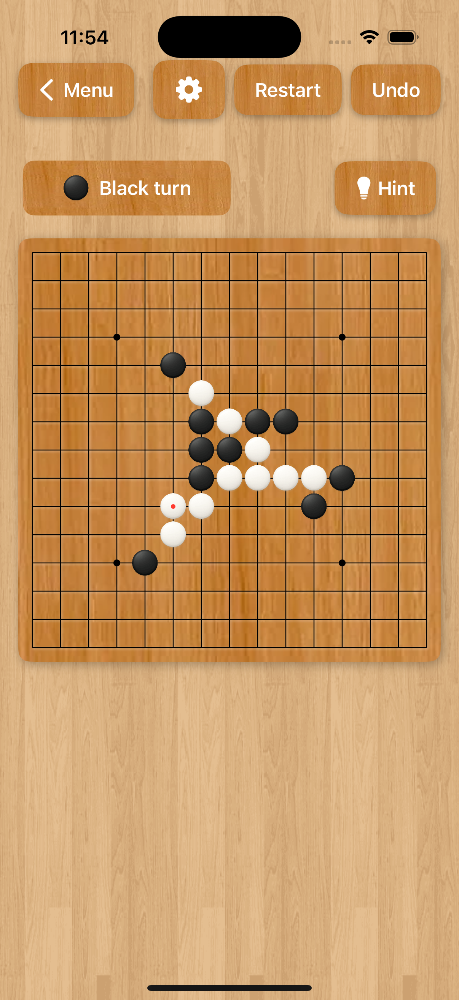
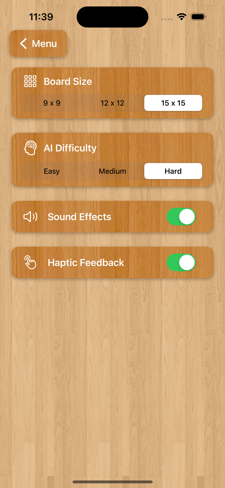

# Gomoku iOS App

A SwiftUI-based iOS implementation of the classic Gomoku (Five in a Row 五子棋) board game.

## 🎮 About

Gomoku is a strategic board game where two players take turns placing stones on a 15x15 grid. The first player to get five stones in a row (horizontally, vertically, or diagonally) wins the game.

## 📸 Screenshots

<p align="center">
  
  
  
  
</p>

## 🚧 Status: Work in Progress

This project is under active development. The game is fully playable in both local two‑player and single‑player (vs AI) modes.

### ✅ Completed Features
- **Core Gameplay**: Local 2P and Single Player vs AI
- **Board Sizes**: 9×9, 12×12, 15×15 (Settings)
- **AI Difficulty**: Easy, Medium, Hard with immediate win/block logic
- **Game Logic**: Turn management, win/draw detection, winning line highlight
- **Controls**: Restart, Undo
- **UI**: Modern SwiftUI interface, wooden board, status banner
- **Haptics**: Light impact on valid moves; warning on invalid taps (toggle in Settings)

### 🔄 In Progress
- Game state persistence (resume games)
- Sound effects (UI toggle present; implementation WIP)
- UI/UX refinements and performance tuning

### 📋 Planned Features
- [ ] Game statistics and history
- [ ] Dark/Light theme support
- [ ] Accessibility improvements
- [ ] Game Center integration (optional)

## 🛠 Technical Stack

- **Language**: Swift 5.9+
- **Frameworks**: SwiftUI, Combine
- **Architecture**: MVVM-style with `@MainActor` state model
- **Testing**: XCTest
- **Platform**: iOS 17.0+

## 🏗 Project Structure

```
Gomoku/
├── Gomoku/
│   ├── App/
│   │   └── GomokuApp.swift        # App entry point
│   ├── Game/
│   │   ├── GameModel.swift        # @MainActor state model
│   │   ├── RulesEngine.swift      # Validation and win/draw detection
│   │   ├── AI.swift               # AI (Easy/Medium/Hard)
│   │   └── Haptics.swift          # Haptic feedback helpers
│   ├── Models/
│   │   ├── Player.swift
│   │   ├── Cell.swift
│   │   ├── Move.swift
│   │   └── Board.swift
│   ├── Style/
│   │   └── WoodButtonStyle.swift  # Custom wood-styled buttons
│   └── Views/
│       ├── MainMenuView.swift     # Single Player / Two Players / Settings
│       ├── GameView.swift         # Game screen and toolbar actions
│       ├── BoardView.swift        # Interactive board with stones and win line
│       └── SettingsView.swift     # Board size, AI level, haptics toggle
├── GomokuTests/
│   └── GomokuTests.swift          # Test suite
└── Assets.xcassets/               # App assets and icons
```

## 🚀 Getting Started

### Prerequisites
- Xcode 15.0 or later
- iOS 17.0+ deployment target
- macOS 14.0+ (for development)

### Installation
1. Clone the repository:
   ```bash
   git clone https://github.com/banghuazhao/Gomoku.git
   cd Gomoku
   ```

2. Open the project in Xcode:
   ```bash
   open Gomoku.xcodeproj
   ```

3. Build and run the project (⌘+R)

## 🎯 How to Play

1. **Starting**: Black plays first
2. **Turns**: Players alternate placing stones on empty intersections
3. **Objective**: Get five stones in a row (horizontally, vertically, or diagonally)
4. **Controls**:
   - Tap any empty intersection to place a stone
   - Use "Undo" to take back the last move
   - Use "Restart" to start a new game
   - In Single Player, the AI moves automatically on its turn

## 🔧 Settings

- **Board Size**: Choose 9×9, 12×12, or 15×15
- **AI Difficulty**: Easy, Medium, Hard
- **Haptic Feedback**: Toggle on/off
- **Sound Effects**: Toggle present; audio implementation in progress

## 🤖 AI Overview

- Prioritizes immediate wins and blocks opponent's immediate wins
- Medium: heuristic scoring of lines and open ends
- Hard: shallow minimax with alpha–beta pruning over candidate moves


## 🤝 Contributing

This is a personal project, but suggestions and feedback are welcome! Feel free to:
- Report bugs or issues
- Suggest new features
- Submit pull requests for improvements

## 📄 License

This project is open source and available under the [MIT License](LICENSE).

## 👨‍💻 Author

**Banghua Zhao**
- GitHub: [@banghuazhao](https://github.com/banghuazhao)

## 🙏 Acknowledgments

- Inspired by the classic Gomoku board game
- Built with modern Swift and SwiftUI best practices
- Thanks to the Swift and iOS development community

---

**Note**: This project is actively being developed. Features and implementation details may change as the project evolves.
